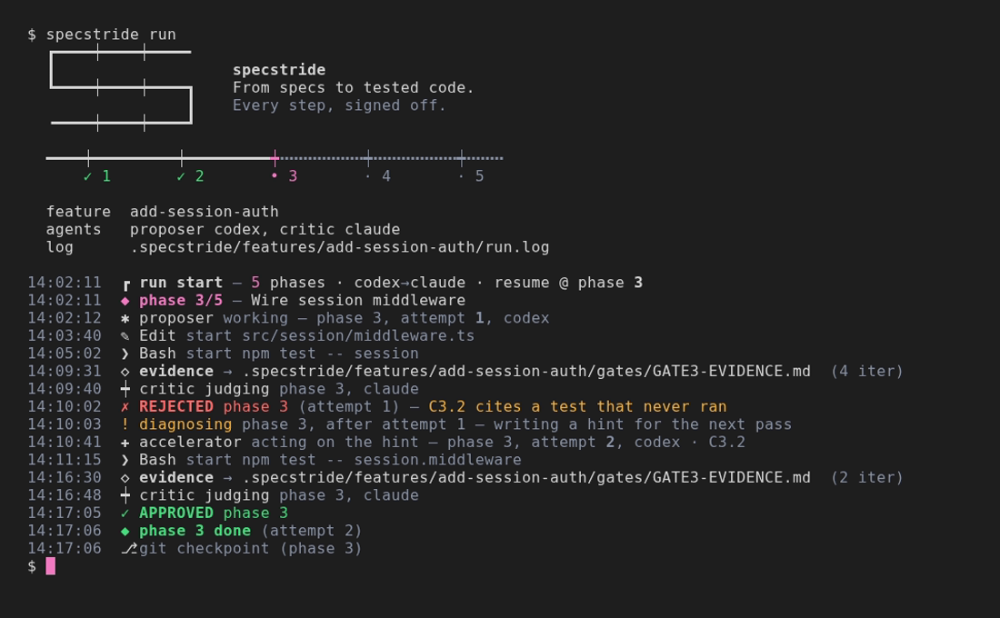
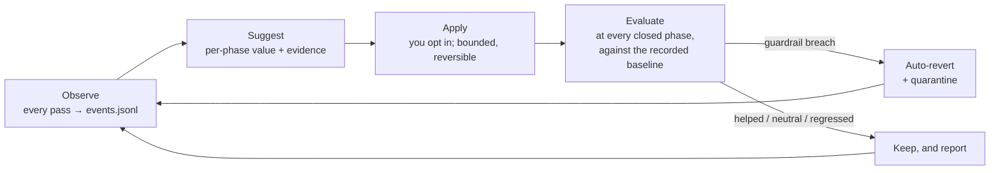
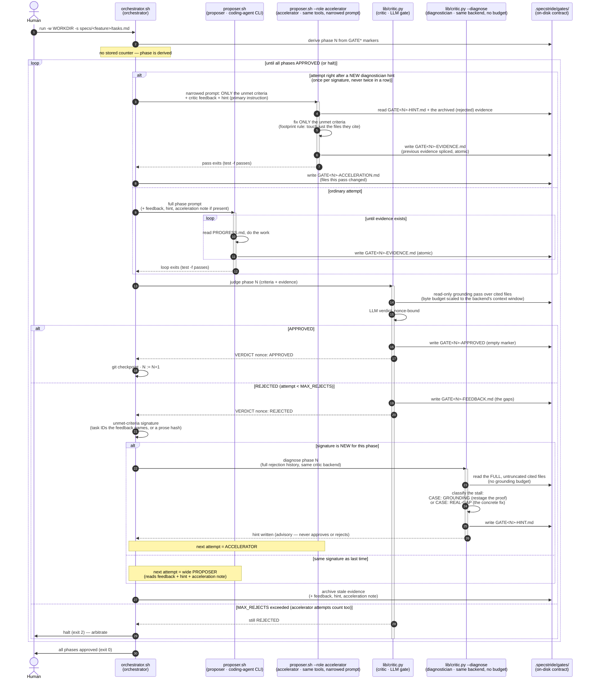

# Specstride

[](https://github.com/mairp/specstride/actions/workflows/ci.yml)
[](LICENSE)


[](wiki/Telemetry.md)

**Specstride**. From specs to tested code. An autonomous coding
orchestrator that steers your agent through implementation, critic review, and
verification, phase by phase: a spec-driven agent loop with a critic gate,
wrapped in an outer loop that tunes its own budgets from its telemetry, checks
whether each change helped, and rolls it back when it did not.

<!-- Rendered from docs/media/specstride.tape: `vhs docs/media/specstride.tape` from the repo root. -->


*Every step, signed off.* The mark is the track folded into an S; the rail under
it shows the feature's real phases, and each gate opens only on approved evidence
([animated version](docs/media/specstride.gif)). The inner loop is the Ralph
technique (fresh context every pass); Specstride adds the gate that holds each
phase until its evidence is approved.

**Try it in a minute** (needs Python 3.13, Bash, the [Claude Code](https://docs.anthropic.com/claude-code) CLI for
the proposer and `ANTHROPIC_API_KEY` for the critic, or swap in `codex` and `OPENAI_API_KEY`):

```bash
git clone https://github.com/mairp/specstride && cd specstride
mkdir -p /tmp/demo/specs/001-greeting && cp examples/speckit-tasks.example.md /tmp/demo/specs/001-greeting/tasks.md
SPECSTRIDE_PROPOSER=claude SPECSTRIDE_CRITIC=claude ./specstride run -w /tmp/demo
```

Then run `./specstride watch -w /tmp/demo` in another terminal to follow it. The full setup is in [Quick start](#quick-start).

You hand it a [GitHub Spec Kit](https://github.com/github/spec-kit) feature — its
`tasks.md`, an ordered set of phases, each a list of tasks — and it drives a coding
agent phase by phase, but *nothing advances until a critic approves it*. The
feature's `spec.md`, `plan.md` and contracts ride along as read-only context for both
the agent and the critic. The human who used to eyeball each phase and click
"approved" is replaced by an LLM-backed critic. You stay out of the inner loop;
you only arbitrate the phases the machines genuinely can't settle.

Specstride runs a coding agent in a repeating, self-checking loop: each pass is
a fresh, stateless session that works until the phase's evidence file exists.
On top of that plain loop it adds three things:

- **An automated critic gate.** An LLM critic checks each phase's evidence
  against the spec's acceptance criteria and the real code. Nothing advances
  until the critic approves it.
- **A diagnose-and-accelerate micro-loop for stuck phases.** A plain retry loop
  retries a rejected phase from scratch, so a stuck phase can burn pass after
  pass and learn nothing new. When a phase stalls on a new set of unmet
  criteria, Specstride runs the [diagnostician](#diagnostician-stuck-loop-mitigation).
  It reads the full rejection history and the untruncated files, then says
  whether the critic simply couldn't see the code or the gap is real, and what
  to change. The [accelerator](#accelerator-acting-on-the-diagnosticians-hint)
  acts on that hint: a narrowed retry that fixes only the failing criteria and
  leaves approved work untouched. On one real 12-task phase, a full retry had
  spent 16 minutes re-deriving what turned out to be a two-file fix.
- **An opt-in learning loop over its own runs.** Every pass is recorded in
  `events.jsonl`. `specstride learn` reads that history and suggests per-phase
  settings sized to what each phase actually measured, instead of one global
  setting sized for the worst phase. You apply a suggestion explicitly; it is
  bounded, keyed to the phase as written (edit the phase and the old decision
  stops applying), and reversible. After it is applied, every closed phase
  **evaluates** it against the baseline it was learned from — `helped`,
  `neutral`, `regressed` or `insufficient`, always printed beside the smallest
  effect the data could show — and a guardrail breach (more MALFORMED verdicts, a
  new verification failure, a shift in first-attempt approval, …) **reverts it
  automatically** and quarantines the value. A pass that rewrites the telemetry
  it is judged by is excluded. It can never touch anything the critic reads. See
  [Learning](#learning-self-tuning-knobs).

### Three loops, one of them self-tuning

| Loop | Scope | What repeats | What carries over |
|---|---|---|---|
| **Pass loop** (inner) | one phase attempt | a fresh, stateless agent session per pass, until the phase's evidence file exists | only what is on disk |
| **Gated phase loop** (middle) | one run | proposer → critic → approve or retry; a stuck phase gets the diagnostician and a narrowed accelerator retry | the feedback and hint files, within the run |
| **Learning loop** (outer) | across runs | measure every pass, suggest (and, opt-in, apply) per-phase settings, then evaluate each applied one against the baseline it was learned from, reverting it automatically if a guardrail breaks | a per-phase observation and an append-only log of decisions, their baselines and their evaluations |

The agents never improve; they stay stateless workers. What improves is how the
loop drives them. The learning loop is deliberately narrow: it can tune two
allowlisted settings, it is off unless you turn it on, and the critic's
independence is locked by a test. A loop that could tune its own judge would
drift toward approving its own work.

You write the spec; the loop takes it to verified code. You step in only for
the phases the machines genuinely can't settle.

> 📖 **Full documentation lives in the [`wiki/`](./wiki) folder** — start at
> [`wiki/Home.md`](./wiki/Home.md). It covers the
> [architecture](./wiki/Architecture.md), [getting started](./wiki/Getting-Started.md),
> the [CLI](./wiki/CLI-Reference.md), [spec formats](./wiki/Spec-Formats.md), the
> [on-disk contract](./wiki/On-Disk-Contract.md), [hardening](./wiki/Hardening.md),
> [telemetry](./wiki/Telemetry.md), and [configuration](./wiki/Configuration.md).

## How it improves itself

Specstride gets better at driving its agents by learning from its own runs, and it
checks every change it learns before keeping it. The agents themselves never change;
what improves is how the loop sizes and paces their work. The whole layer is off
unless you set `SPECSTRIDE_LEARNING`.



1. **Observe.** Every pass is measured: wall time, time spent waiting, cost, how it
   ended. At each approved phase, a per-phase observation is written next to the
   feature's state.
2. **Suggest.** `specstride learn --show` proposes a value for each phase from what that
   phase actually measured, with the sample count behind it. It needs at least three
   samples, and ignores passes killed for going nowhere.
3. **Apply.** You apply one suggestion at a time (`specstride learn --apply`). Each
   decision is clamped to a hard range, moves at most ±50 % per step, is filed under the
   phase *as written* (edit the phase and the decision stops applying), and records the
   baseline it was learned from. `--revert` and `--off` undo it.
4. **Evaluate.** After every approved phase, each applied decision is compared with its
   baseline and labelled `helped`, `neutral`, `regressed` or `insufficient`. The effect
   is always printed beside the smallest effect the data could have shown, because runs
   are few and a small change is invisible at that scale.
5. **Keep or roll back.** Guardrails can veto a decision even when it made things
   cheaper: more malformed critic verdicts, more ungrounded citations, a new
   verification failure, bigger critic inputs, more phases handed back to a human, or a
   shift in first-attempt approval in either direction. A breach reverts the decision
   automatically, the only change the loop ever makes on its own, and blocks that value
   until there is fresh evidence.

Two knobs can move: the per-phase pass ceiling (`proposer_timeout`) and the yield poll
interval (`yield_poll_interval`). Nothing the critic reads, no breaker, and nothing in the
verification commands can ever be tuned; tests lock both the list of knobs and every
place the learning code is called from. A pass that rewrites the telemetry it is judged
by is excluded from every evaluation. Run through a mixture-of-loops contract, the
decisions a run may use are bound into the contract, so a later change waits for a new
contract instead of slipping into a relaunch.

Details, formulas and file formats: [Learning](#learning-self-tuning-knobs) below and
[`wiki/Learning.md`](./wiki/Learning.md).

### Under mixture-of-loops: who decides what

When a [mixture-of-loops](https://github.com/mairp/mixture-of-loops) contract drives the run,
the harness running the skill does **not** decide how the loop improves. It records two
choices when it derives the contract, and after that it only reads:

| Step | Who decides | Where it shows |
|---|---|---|
| Learning mode (`off`, `suggest`, `apply`) | the operator, in the request; the deriving harness writes it literally into each `specstride` stage's `env` (default `off`; a value left in the shell is stripped) | the contract, so its digest records it |
| Which applied decisions the run may use | bound at derivation: `configuration.learning` pins the decision log up to one run id, with a hash (`SPECSTRIDE_LEARNING_THROUGH`) | the contract; a later `--apply` waits for a new contract |
| Measure, suggest, evaluate, auto-revert on a guardrail breach | Specstride itself, inside the run | `learning/`, `knob_evaluated`, `knob_auto_reverted` |
| Applying a new decision | the operator (`specstride learn --apply`); never the harness, never automatic | `learning/applied.json` |
| Relaunching after a transient stop | the supervisor, within the contract's budget; refused with `learning-decisions-changed` if the bound decisions changed | the supervisor's report |
| Retrospective | `supervise.py retro` reads what Specstride measured and may *suggest* `specstride learn --revert`; it never applies or reverts | `runs/<id>/retrospectives/<digest>.json` |

## Specstride is a utility; your project lives elsewhere

Install Specstride once (clone it wherever you keep tools); it is *not* the working
directory. Each run points at your project:

- **`-w/--workdir DIR`** — where the proposer works. All generated state lives
  under `.specstride/features/<slug>/` (gates, evidence, PROGRESS.md, verdicts), so the
  workdir root holds only your real artifacts. Default: `$PWD`.
- **`-s/--specs FILE`** — the spec, normally a Spec Kit feature's
  `specs/<feature>/tasks.md`. Inside a Spec Kit project you can leave it out: the
  feature is [auto-discovered](#spec-resolution-zero-flag-start). A relative path
  resolves against the directory you launched from, not the workdir.
- **`--feature SLUG`** — the feature namespace for durable state
  (`.specstride/features/<slug>/`), for repos with more than one Spec Kit feature. Also
  `SPECSTRIDE_FEATURE`. Default: the feature dir's basename, or `default`.

So the same installed Specstride drives any project:

```bash
specstride run -w ~/projects/foo                                   # one Spec Kit feature: discovered
specstride run -w ~/projects/foo -s ~/projects/foo/specs/002-billing/tasks.md
```

(`specstride` is the single front-door command — see **Install it permanently**
just below.)

### Pre-loop test automation

Specstride can derive a Lisa-compatible `VerificationPlan v1` before the first
proposer pass. The canonical JSON is hash-bound to the authoritative
specification, while `TEST_PLAN.md` is its human-readable projection.

- `--verification required` is the default. It creates the plan, injects its
  obligations into proposer and critic, runs fixed-argv tests before each approval,
  and runs a cumulative release gate (including on an already-approved resume).
- `--verification plan` creates and injects the plan without executing its gates.
- `--verification off` explicitly disables test-plan creation and execution.

#### Declaring the commands a gate must execute

Left alone, every executable command in the plan comes from `discover_project()`,
a per-framework prober that reads the filesystem: a `package.json` yields its
`test`/`build`/`lint` scripts, a `pyproject.toml` mentioning pytest yields exactly
one `python3 -m pytest <workdir>`. A spec whose phases name *specific* verification
commands is therefore gated on something it never asked for, and the gap is silent —
the gate passes, the evidence looks clean, and the commands the spec named were
never run.

`--verification-commands FILE` closes that gap. The document lists the commands the
gates MUST execute; each joins its phase's suite (after the discovered ones) and the
release suite:

```json
{
  "schema_version": "1.0.0",
  "commands": [
    {
      "id": "p0-canonical-embedded",
      "phase": 3,
      "executable": "uv",
      "args": ["run", "python", "scripts/verify_canonical_run_e2e.py", "--mode", "embedded"],
      "cwd": "/abs/path/to/project",
      "timeoutSec": 900,
      "env": {"ADLC_SPECIALIST_SOURCE": "fixture"}
    }
  ]
}
```

- `phase` is the spec's phase number. A phase the spec does not define aborts the
  preflight — commands no gate could reach would otherwise sit unexecuted while the
  run reported success.
- `executable` may be a bare name; it is resolved on `PATH` **at plan time** and
  stored absolute, so the plan records what will actually run. Unresolvable aborts.
- `env` is an overlay on the run environment, not a replacement, and is rendered
  into the command line the proposer and `TEST_PLAN.md` see.
- Commands still execute with `shell=False` by argv. There is no shell string form.
- The document's hash is bound into the plan hash, so editing it after planning
  invalidates the plan rather than quietly changing what a gate checks.
- Declared commands satisfy `--verification required` on their own: a project with
  nothing discoverable is no longer refused when it has declared commands to run.

Gate evidence records the revision it ran against — `sourceRevision.revision` from
`git rev-parse HEAD` plus `workingTreeDirty` — because an exit code proves nothing
if you cannot say which tree produced it. When the workdir is not a repository the
field carries `available: false` and a reason rather than being omitted.

#### Pre-staging a long measurement, so the gate runs it once

A 90-minute live suite does not fit inside a proposer pass that must cite it, and a
cumulative gate re-runs it module by module every later phase (across feature
`002-extproc-data-path`, one live suite was launched 159 times). Five optional
fields on a declared entry move that measurement out of the pass and out of the
duplicated gate:

| Field | Default | Meaning |
| --- | --- | --- |
| `stage` | `"gate"` | `"prestage"` runs the command ONCE per attempt, before the proposer pass, and lets that phase's gate reuse the passing result. `"both"` pre-stages it *and* still executes it at the gate. (`"pre"` is accepted as a spelling of `"prestage"`.) |
| `reportPath` | — | workdir-relative artifact the command produces; named in the block the proposer reads, so the pass writes evidence from a file instead of re-running the measurement |
| `reusePolicy` | `"per-attempt"` | how far a passing pre-stage may travel: `per-attempt` (this attempt's gate), `per-phase` (any attempt of that phase), `per-run` (any later gate too) |
| `detached` | `false` | launch it as a job Specstride owns (its own session, its own log) instead of blocking; its `timeoutSec` becomes a polled **deadline** — an expired deadline is reported with the job left running, never signalled |
| `cumulative` | `true` | `false` gates the command at its own phase and at release only, instead of at every later phase gate |

The pre-stage report reaches the pass on the verification slice the proposer prompt
already carries; `verification_plan.py prestage-report --plan … --phase N` prints
the same block. An entry with no `stage` behaves exactly as it does today — same
command id, same gate, same evidence.

**Reuse fails closed, and says where the result came from.** A gate accepting a
result it did not observe is the one change here that can weaken a verdict, so it
is allowed only when every one of these holds: the plan hash matches, the command
id matches, `git rev-parse HEAD` is *the same revision* the pre-stage ran against,
and the working tree is clean at both ends. Anything else — a moved revision, a
dirty tree, an unavailable revision, an unknown attempt, a pre-stage that failed or
is still running — re-runs the command. Every adopted record carries `reusedFrom`
(the pre-stage evidence path, its phase/attempt, the plan hash and the revision),
so the gate document never claims an execution it did not perform.

Because a dirty tree refuses reuse, keep the run's own artifacts out of `git status`
— `.specstride/` and `testautomation/` in `.gitignore` — or the tree is dirty from the
first pass and the gate (correctly) re-runs everything. `cumulative: false` is a real
weakening of the cumulative-regression property, so it is opt-in per command and is
reported in the plan's `assumptions` block, never inferred.

By default, each feature gets isolated artifacts at
`<workdir>/testautomation/<feature>/TEST_PLAN.md` and
`<workdir>/testautomation/<feature>/generated/`. Operator overrides must be absolute,
resolve inside the workdir, and not target a final-path symlink. A maximum-observability
run against Lisa is:

```bash
SPECSTRIDE_AGENT_STREAM=true SPECSTRIDE_LIVE_DETAIL=full \
/home/marlon.lopez/specstride/specstride run \
  --workdir /home/marlon.lopez/lisa \
  --specs /home/marlon.lopez/lisa/specs/specification-bundle-v2/tasks.md \
  --spec-format speckit-tasks \
  --feature specification-bundle-v2 \
  --verification required \
  --test-plan /home/marlon.lopez/lisa/testautomation/specification-bundle-v2/TEST_PLAN.md \
  --generate-tests /home/marlon.lopez/lisa/testautomation/specification-bundle-v2/generated \
  --live \
  --debug \
  --telemetry \
  --loki-url http://127.0.0.1:13011 \
  --otel \
  --otel-url http://127.0.0.1:13018
```

Planning can also be run independently, before any loop:

```bash
/usr/bin/python3 \
  /home/marlon.lopez/specstride/lib/verification_plan.py create \
  --workdir /home/marlon.lopez/lisa \
  --specs /home/marlon.lopez/lisa/specs/specification-bundle-v2/tasks.md \
  --format speckit-tasks \
  --output /home/marlon.lopez/lisa/testautomation/specification-bundle-v2/TEST_PLAN.md \
  --json-output /home/marlon.lopez/lisa/.specstride/verification/verification-plan.json \
  --generate-tests /home/marlon.lopez/lisa/testautomation/specification-bundle-v2/generated \
  --required
```

The Bash entry points (`orchestrator.sh`, `proposer.sh`, `specstride`) sit at the top
level; all Python components live under **`lib/`** (`lib/critic.py`, `lib/learn.py`,
`lib/present.py`, and the Loki and OTLP shippers).

### Install it permanently (one `specstride` command)

Typing `~/specstride/orchestrator.sh …` every run gets old fast. The **`specstride`
script is already the single front door for *everything*** — it owns the routing
itself: `specstride run …` (or a leading `-w/-s/--flag`) **starts** the loop by
`exec`ing `orchestrator.sh`, while `specstride status`, `specstride watch`, `specstride stop`,
… run the inspection CLI. So all your shell rc needs is a **thin pointer** at the
script — no dispatch logic to copy, nothing to keep in sync.

Add this to `~/.bashrc` (or `~/.zshrc`):

```bash
# ── Specstride ─────────────────────────────────────────────────────────────
export SPECSTRIDE_HOME="$HOME/specstride"         # wherever you cloned it — set once
export SPECSTRIDE_LIVE_DETAIL=full             # richest live view — narrates assistant text + every tool call

# `specstride` owns its own run-vs-inspect routing, so this is just a pointer.
specstride() { "$SPECSTRIDE_HOME/specstride" "$@"; }
# ───────────────────────────────────────────────────────────────────────
```

Reload once (`source ~/.bashrc`) and the one command drives every example below,
from any directory:

```bash
specstride run -w ~/projects/foo -s ~/projects/foo/ROADMAP.md   # START a loop
specstride -w ~/projects/foo -s ~/projects/foo/ROADMAP.md       # …same thing, leading flag
specstride status -w ~/projects/foo                             # inspect it
specstride watch  -w ~/projects/foo                             # live status card
specstride stop   -w ~/projects/foo                             # clean halt
```

The routing lives in the script (see the "single front door" block at the top of
`specstride`): `run`/`start` or a leading `-w/-s/--flag` go straight to the
orchestrator; the reserved inspection verbs and `-h/--help` stay in the CLI. Use
the explicit **`specstride run …`** form whenever you want to be unambiguous (or in
scripts).

> **Why a function and not a `symlink`/PATH shim?** The scripts locate their own
> `lib/` and `specstride-lib.sh` via `dirname "${BASH_SOURCE[0]}"`, which does **not**
> dereference symlinks — a `ln -s … /usr/local/bin/specstride` would resolve its home
> to `/usr/local/bin` and fail to find `specstride-lib.sh`. The function calls the real
> absolute path under `$SPECSTRIDE_HOME`, so `SCRIPT_DIR` stays correct. (Prefer PATH?
> `export PATH="$SPECSTRIDE_HOME:$PATH"` also works, and because the script owns its own
> run-vs-inspect routing, bare `specstride run …` starts a loop that way too — no
> function needed. The function is just the tidiest way to pin `$SPECSTRIDE_HOME`.)

The rest of this README uses the unified **`specstride`** command — `specstride run …` (or
a leading `specstride -w …`) to start, `specstride <verb> …` to inspect. Because the
script owns the routing, you don't even need the function: call
`"$SPECSTRIDE_HOME"/specstride …` directly and both `specstride run …` and the inspection
verbs work the same way.

## How it works

```
orchestrator.sh   (derives the current phase N from disk; reads the feature's tasks.md)
  │
  ├─(1) PROPOSER — run a headless coding-agent loop for phase N until it writes
  │       .specstride/gates/GATE<N>-EVIDENCE.md (written atomically), then the loop exits.
  │       On the attempt right after a NEW diagnostician hint this is the
  │       ACCELERATOR instead: the same proposer.sh, --role accelerator, with a
  │       prompt narrowed to the unmet criteria, the feedback, the hint and the
  │       evidence to splice. Once per hint, never twice in a row (see below).
  │
  ├─(2) CRITIC — lib/critic.py reads phase N's acceptance criteria + the evidence,
  │       does a read-only grounding pass over the files the evidence cites (byte
  │       budget scaled to the critic backend's real context window), and asks an
  │       LLM for a strict verdict:
  │           APPROVED → writes an empty .specstride/gates/GATE<N>-APPROVED marker
  │           REJECTED → writes .specstride/gates/GATE<N>-FEEDBACK.md (the specific gaps)
  │
  ├─(3a) APPROVED → git-checkpoint the workdir, N := N+1, back to (1).
  └─(3b) REJECTED → compute the phase's UNMET-CRITERIA SIGNATURE (the T### IDs the
           feedback names, or a hash of its prose), then:
             NEW signature  → run the DIAGNOSTICIAN (lib/critic.py --diagnose: the
                              same critic backend, the FULL untruncated files, no
                              grounding budget) → .specstride/gates/GATE<N>-HINT.md.
                              The next attempt is the ACCELERATOR.
             SAME signature → archive the rejected evidence and re-run the wide
                              PROPOSER with the feedback + hint. If the previous
                              attempt was the accelerator, its GATE<N>-ACCELERATION.md
                              (what it changed) is in the prompt so it is not redone.
           Bounded by MAX_REJECTS (accelerator attempts count); on exceed, halt and
           leave everything on disk for a human.
```

The same loop as a UML sequence — the five roles (orchestrator, proposer,
accelerator, critic, diagnostician) each on their own lifeline, the
approve/reject branch, and the stuck-loop path (new signature → diagnostician →
accelerator), all mediated by the `.specstride/gates/` files rather than direct calls:



There is **no file-watcher**. Detection is deterministic: the proposer loop's
gate is a plain `test -f .specstride/gates/GATE<N>-EVIDENCE.md`, and because that loop has already
exited when control returns, the orchestrator hands the critic the exact path —
no race, no half-written file.

### Diagnostician (stuck-loop mitigation)

A large phase can cite more files than the critic's grounding snapshot can fit in
one budget (`GROUNDING_TOTAL_CAP`), so the same file gets degraded to a head/tail
excerpt — or elided — on every attempt. When that's the actual cause, the
criterion never converges: the critic isn't wrong about what it *can* see, it
just can't see enough, and a plain retry burns a full proposer+critic pass to
learn nothing new.

The orchestrator tracks each phase's unmet-criteria signature (the `T###` IDs a
rejection names). The FIRST time a new signature appears, it runs `lib/critic.py
--diagnose`: one extra pass, same critic backend (`SPECSTRIDE_CRITIC`), given the
full rejection history and the FULL, untruncated content of the cited files —
no grounding budget. It classifies the stall as `CASE: GROUNDING` (the code is
fine, the critic just couldn't see it — and says what to restage) or
`CASE: REAL-GAP` (a genuine gap — and what to fix), and writes
`.specstride/gates/GATE<N>-HINT.md`, which the next proposer prompt reads alongside
the critic's own feedback.

It never re-fires on an unchanged signature (no point paying for the same
answer twice), never blocks or replaces the normal retry, and never approves or
rejects anything itself — it's advisory. Disable with `SPECSTRIDE_DIAGNOSTICIAN=false`.

### Accelerator (acting on the diagnostician's hint)

The diagnostician knows the fix but cannot touch the tree (it is a tool-free
critic call). Left alone, the next proposer pass re-reads the FULL phase prompt
(every task, contract and verification obligation) to re-derive a change the
hint already spelled out — on a real 12-task phase that was a 16-minute pass to
apply a two-file diff.

The **accelerator** is that retry pass, narrowed. It is `proposer.sh` with the
same tools and (by default) the same backend, run with `--role accelerator` and a
prompt that carries only:

- the unmet criteria (by the diagnostician's `T###` signature; the whole phase
  for prose-only specs) and only *their* verification obligations,
- the critic feedback, and the hint as the **primary instruction**,
- the archived evidence, with the order to splice only the rejected criteria's
  sections and leave everything else byte-for-byte,
- a footprint rule: touch only files the unmet criteria and the hint cite.
  Confirmed criteria are pinned (W9) to a content hash of their backing files;
  a wide edit drops those pins and re-opens criteria that already passed.

Sequencing is strict — one writer at a time, never a parallel agent:

```
reject → diagnostician (new signature → GATE<N>-HINT.md)
       → attempt N+1 = ACCELERATOR (once per signature)  → verification → critic
             APPROVED → done
             REJECTED, same signature → attempt N+2 = wide PROPOSER, whose prompt
                        carries GATE<N>-ACCELERATION.md (files the accelerator
                        changed + its own notes) so it does not redo that work
             REJECTED, new signature  → diagnostician → accelerator again
```

An accelerator attempt counts toward `MAX_REJECTS` like any other, and it never
runs twice in a row. Its prompt is written to `accelerator-prompt.phase<N>.txt`
next to the proposer's; its invocation artifacts land under `.../accelerator/`.
Disable with `SPECSTRIDE_ACCELERATOR=false`; point it at a different model with
`SPECSTRIDE_ACCELERATOR_BACKEND`.

### Grounding budget scales to the actual critic backend's context window

`GROUNDING_TOTAL_CAP` (and the diagnostician's own, larger budget) is not one
flat number for every provider — each real backend has a different context
window, and using one number for all of them either wastes headroom on a
bigger window (this is the SAME starvation failure the diagnostician exists
for, just from under-sizing instead of an oversized phase) or risks
overflowing a smaller one. Specstride resolves the actual window per call — the
Claude/OpenAI providers call those vendors' APIs directly, so they're keyed
against the vendors' own published windows (Claude Opus 4.8: 1,000,000; GPT-5:
400,000), not a local fleet's internal operational settings for an unrelated
routing path. DSH/bebop genuinely do route through this fleet's local
infrastructure, so THEIR numbers come from there instead: a locally-served
Qwen3.8 at whatever this fleet measured it can actually load (229,376 on the
reference 24 GB card), GLM-5.3 at its declared 128,000. The byte budget scales
from whichever of these actually applies, instead of guessing or hardcoding
one provider's number for all of them.
Override with `SPECSTRIDE_CRITIC_CONTEXT_TOKENS` for any backend the built-in
table doesn't know (in particular Prime, whose backing model isn't visible to
`critic.py` at all) or to correct a host-specific deployment.

## Quick start

Clone, set your key, alias, run:

```bash
cp .env.example .env          # then edit: set ANTHROPIC_API_KEY

# one-time setup (see "Install it permanently" above): add the thin specstride()
# pointer to ~/.bashrc, pointing SPECSTRIDE_HOME at this clone, then reload:
source ~/.bashrc

mkdir -p /tmp/specstride-demo/specs/001-greeting
cp examples/speckit-tasks.example.md /tmp/specstride-demo/specs/001-greeting/tasks.md
specstride run -w /tmp/specstride-demo       # discovers specs/001-greeting/tasks.md
```

(Not set up yet? The one-off equivalent calls the script directly:
`"$SPECSTRIDE_HOME"/specstride run -w /tmp/specstride-demo` — or `./specstride run -w
/tmp/specstride-demo` from inside the clone.)

Pick the backends with `SPECSTRIDE_PROPOSER` and `SPECSTRIDE_CRITIC` (in `.env` or the
environment): `claude`, `codex`, `dsh`, or `bebop` (see **Configuration**). The two roles are
independent, so a cheap model can propose while a stronger one judges. The bundled
`examples/speckit-tasks.example.md` is a small, verifiable Spec Kit task list, so you can
watch the whole loop end to end. In a real project, generate the feature with Spec Kit
(`/speckit.specify`, `/speckit.plan`, `/speckit.tasks`) and point Specstride at it.

## Live visibility (on by default)

A backgrounded loop is not a black box. Every meaningful step emits one
structured event, and a **presenter** renders it in real time — in **full color**,
with **zero containers**. Two views over the same event stream:

- **Inline timeline (`--live`, auto-on at a TTY):** when you launch the
  orchestrator in a terminal, it streams a clean, colored, scrolling timeline
  **right there** — like watching a coding agent work — while the noisy raw
  proposer/critic output goes to `run.log` only. The proposer's agent stream is
  narrated as it happens: each tool call gets its **own color and glyph** (Read
  `◎`, Write `✚`, Edit `✎`, Bash `❯`, Grep/Glob `❍`, …), timestamps recede to
  gray so the action carries the color, and every end-of-pass line shows the
  **cost / tokens / duration / turns** each tinted. Whenever the agent goes quiet
  for more than a couple of seconds, an animated **heartbeat** (spinner + pulse
  bar) keeps the current activity and running totals visibly moving. No second
  terminal, no `specstride watch`. Color auto-strips when stdout isn't a TTY, or force
  it off with `--no-color`; force the whole view off with `--no-live` (restores the
  raw tee'd output).
  ```
  14:02:41  ◎ Read  proposer.sh
  14:02:43  ❯ Bash  npm test
  14:02:44  ⠹▄ proposer working · 3s  · run $0.04 · 12.1k tok out · 1 pass · 41s
  14:03:02  ⏺ pass done · $0.12 · 5.1k tok · 18s · 12 turns
  14:03:03  ✓ evidence → GATE2-EVIDENCE.md  (1 iter)
  14:03:19  ✗ REJECTED phase 2 (attempt 1) — criterion 3: no passing test
  ```
  **Verbosity** is `SPECSTRIDE_LIVE_DETAIL` (`milestones | tools | full`; default
  `tools`). Set it in `.env` or inline per run. `full` adds each assistant
  thinking/narration line (`💬`) on top of the tool calls — the most detailed view:

  ```bash
  SPECSTRIDE_LIVE_DETAIL=full specstride run -w ~/projects/foo --live
  ```

  (`milestones` is the sparsest — only coarse loop milestones, no per-tool lines.)

- **Live status card:** `specstride watch` — a compact header (phase progress + current
  activity + heartbeat) over a **scrolling recent-activity feed**, so the latest
  message is always visible in place without scrolling. Attach to a backgrounded run.
  Honors `SPECSTRIDE_LIVE_DETAIL` the same way:
  ```bash
  SPECSTRIDE_LIVE_DETAIL=full specstride watch -w ~/projects/foo
  ```

## The `specstride` inspection CLI

Everything is read-only **except `stop`, `resume`, and `learn --apply|--revert|--off`**
— those are the only subcommands that mutate anything (`learn`'s writes are
confined to its own `learning/applied.json` decision log and a `knob_adjusted`
event; see [Learning](#learning-self-tuning-knobs) below).

All inspection subcommands take `--feature SLUG` and default to the **last run's
feature** (from `.specstride/last-run.conf`); `status --all` spans every feature.

| Command | Shows / does |
|---|---|
| `specstride status [-w DIR] [-s SPEC] [--feature S] [--all]` | one-screen state: a run-state headline (RUNNING / STOPPED / HALTED / DONE) + current phase + a ✓/✗ table of which contract files exist. `--all` lists every feature with its approved/total phase counts |
| `specstride phases [-w DIR] [-s SPEC] [--feature S]` | phases parsed from the spec + each one's state (also lints the spec) |
| `specstride tail   [-w DIR] [--feature S]` | `tail -f` the orchestrator `run.log` (the raw log) |
| `specstride events [-w DIR] [--feature S] [-f\|--follow] [--json]` | the raw event stream ("RPC view"): every milestone **and** every agent tool call / message as `HH:MM:SS event key=value…` lines. `--follow` streams; `--json` emits the raw JSONL |
| `specstride verdicts [-w DIR] [--feature S] [N]` | the critic's full reply(ies): prompt + response + parse decision |
| `specstride feedback <N> [-w DIR] [--feature S]` | `GATE<N>-FEEDBACK.md` |
| `specstride watch  [-w DIR]` | the live status card (with heartbeat + run totals) |
| `specstride stop   [-w DIR] [--now]` | **(mutates)** request a clean stop — writes `stop.flag`; the run finishes its current pass and exits 6. `--now` also kill-trees the in-flight proposer pass so it stops within seconds. Stops the single running run regardless of feature |
| `specstride resume [-w DIR] [--feature S] [overrides…]` | **(mutates)** relaunch the orchestrator from the saved config of the last run (`.specstride/last-run.conf`, or a feature's own with `--feature`); refuses if a run is already active. Extra args override the saved flags (last-wins) |
| `specstride learn  [-w DIR] [--feature S] [--show\|--apply\|--revert <run-id>\|--off\|--summarize\|--evaluate]` | the self-tuning loop over this feature's telemetry — see [Learning](#learning-self-tuning-knobs). `--show` (default), `--summarize` (the metric JSON over every run) and `--evaluate` (what evaluation would conclude now; always a dry run) are read-only; `--apply`/`--revert`/`--off` **mutate** `learning/applied.json` |

## Learning (self-tuning knobs)

Specstride can suggest — and, opt-in, apply — per-phase knob values derived from what
that phase has actually measured, instead of one global setting sized for the
worst phase in the project. This is deliberately narrow: **suggest is the
default, nothing is ever applied silently, and the set of knobs it may ever touch
is a locked allowlist that can never include anything the critic reads.** Full
design: `roadmap/research/self-improvement-loops/` (the loop design, §5).

In practice:

```bash
# 1. Let runs record per-phase observations (measurement only, changes nothing)
SPECSTRIDE_LEARNING=suggest specstride run ...

# 2. After a few runs, see what the loop would change and the evidence behind it
specstride learn --show

# 3. Apply one decision you agree with (append-only, with provenance)
specstride learn --apply --knob proposer_timeout --phase 8 --default 1800

# 4. Launch runs that read applied values
SPECSTRIDE_LEARNING=apply specstride run ...

# Undo one decision, or all of them
specstride learn --revert <run-id>
specstride learn --off

# Read-only: the metric JSON, and what evaluation would conclude now
specstride learn --summarize
specstride learn --evaluate
```

- **Suggest by default.** `specstride learn --show` (or bare `specstride learn`) prints a
  suggested value per phase plus the sample count behind it — it writes nothing.
  Every knob needs **at least 3 samples** of the phase evidence it is derived
  from before a value is shown at all; a phase killed for *futility*
  (`repeat_stall`, `progress_stall`) never contributes a sample to any of the
  three, because that failure's duration means nothing about how long the work
  (or the wait) actually takes. Both allowlisted knobs have a suggestion
  engine:
  - `proposer_timeout` — from the phase's measured `work_sec` (wall time minus
    declared wait/sleep), clamped to `[900 s, 2×default]` and to no more than a
    ±50% step from whatever value is currently in effect.
  - `yield_poll_interval` — from the phase's measured yield job durations
    (`yield_resume`), targeting roughly a tenth of the job's own length so a
    missed tick wastes a small fraction of it rather than a fixed cost; clamped
    to `[10 s, 300 s]` and the same ±50%-per-step window, stepped from the poll
    interval's own default (`SPECSTRIDE_YIELD_POLL`, else 30 s).

  `specstride learn --show`/`--apply` pass the default of the knob you ask about
  when you give no `--default`: `SPECSTRIDE_PROPOSER_TIMEOUT` (else 1800) for
  `proposer_timeout`, `SPECSTRIDE_YIELD_POLL` (else 30) for `yield_poll_interval`.
- **What can never move.** The adjustable-knob allowlist is exactly
  `proposer_timeout` and `yield_poll_interval` — nothing else, ever. (The design's
  third knob, `inject_yield_hint`, was removed: the yield contract is already
  appended to every proposer and accelerator prompt, so it had nothing to switch.) Grounding caps, the critic's backend/timeout, `--max-rejects`, anything in
  `verification-commands.json`, and every breaker setting
  (`SPECSTRIDE_PROPOSER_MAX_ERRORS`/`MAX_NOPROGRESS`/`MAX_CAPS`, `REPEAT_LIMIT`) are
  permanently out of scope: a breaker must never be able to relax itself, and
  nothing that changes what a verdict means may be tuned. `lib/test_learn.py`
  asserts this set literally, so adding a name to it means deliberately editing a
  test that explains why that must not happen. A second test locks where `learn.py` may be
  invoked at all: exactly the two `resolve` calls and the `observe` hook in
  `orchestrator.sh`, and the `specstride learn` dispatcher — and never from
  `lib/critic.py` or `lib/verification_plan.py`.
- **Bounded and reversible.** Every numeric suggestion is clamped to its hard
  bound (above) and to no more than a ±50% step from whatever value is currently
  in effect — a self-tuner cannot run away in one step even if the telemetry
  that produced the suggestion was noisy.
- **Keyed on the phase's shape.** Every sample and every decision is filed under
  the phase's *shape*: a digest of its number, title and criteria text
  (`python3 lib/specstride_spec.py shape N --specs <spec>`), recorded on each
  `phase_start`. Ticking a checkbox or reflowing whitespace does not change it;
  editing a criterion or the title does. After an edit, samples from the old
  phase stop counting toward the 3-sample floor and a decision learned for it
  stops applying — the run resolves the default again. A decision or a run
  recorded before shapes existed matches no shape: it is never silently applied,
  and `resolve`/`--show`/`--apply` print a one-line notice saying so (the run's
  notice goes to its `run.log`). `specstride learn` computes the shapes from the
  feature's spec (`-s`, else the saved `SPECS=`).
- **Applying, and undoing it.** `specstride learn --apply --knob <knob> --phase N
  [--default S] [--force]` appends one decision to
  `.specstride/features/<slug>/learning/applied.json` (a separate, append-only file
  from the plain observations below — decisions and observations are never
  conflated) with full provenance: the phase shape, the run ids the samples came
  from, the sample count, the previous value, and a timestamp
  (`specstride.learn.applied/2`; `/1` entries are still read); it also emits a `knob_adjusted`
  event. `specstride learn --revert <run-id>` undoes exactly that one decision,
  restoring the value from just before it (refused if a later decision has
  already superseded it — reverting a stale one would silently clobber the newer
  one). `specstride learn --off` reverts every currently-applied knob for the
  feature at once. None of this takes effect at run time unless the run itself
  is launched with `SPECSTRIDE_LEARNING=apply` in its environment — **unset, `off`,
  or any other value is a total no-op**: the applied log isn't even opened, and
  behaviour is byte-identical to a project that has never used `learn` at all.
- **What a live run reads.** Under `SPECSTRIDE_LEARNING=apply` a run reads both
  knobs back, once per phase: `proposer_timeout` as the `learned` source of
  `resolve_proposer_timeout`, and `yield_poll_interval` as the poll interval the
  phase's proposer passes run with (`resolve_yield_poll`). An operator's own setting
  still wins over either: `--proposer-timeout-phase` / `SPECSTRIDE_PROPOSER_TIMEOUT_PHASE_<N>`
  for the ceiling, and a set `SPECSTRIDE_YIELD_POLL` (set at all, even to 30) for the
  poll. Both values and their sources are on every `proposer_cap` event.
- **The integration point.** The one place a learned value can reach a live run is
  `lib/learn.py resolve`, a small shell-callable entry point — not a change to
  `orchestrator.sh` itself:

  ```
  python3 lib/learn.py resolve --knob proposer_timeout --phase <N> --default <S>
  ```

  prints one integer to stdout: the applied value for that phase if
  `SPECSTRIDE_LEARNING=apply` and one has been applied, else `<S>` unchanged.

### Observations (`learn.py observe`)

Separately from the applied-decisions log above, `lib/learn.py observe` writes
the §5.4 per-phase **observation** document — exactly that phase's entry from
`summarize`'s metric set, with a schema tag and a generation timestamp — to
`.specstride/features/<slug>/learning/phase-<N>.json`. It is the measurement half of
§5.4's storage table; it never reads or writes `applied.json`, and nothing
reads it automatically today — it exists so a phase's own cross-run history is
sitting on disk for a human, `specstride learn --show`, or a future run of the same
phase to read, instead of being re-derived from every run's raw `events.jsonl`
each time. It is idempotent: the same input always overwrites `--out` with the
same `"observation"` content, so it is safe to call unconditionally.

```
python3 lib/learn.py observe --events <events.jsonl|run-dir|runs-dir> --phase <N> \
                             [--out <feature-dir>/learning/phase-<N>.json]
```

The exact line an orchestrator's `phase_done` hook would call (one line, using
the orchestrator's own `$LIB_DIR`, `$FEATURE_DIR`, and current-phase `$n`):

```
python3 "$LIB_DIR/learn.py" observe --events "$FEATURE_DIR/runs" --phase "$n" \
  --out "$FEATURE_DIR/learning/phase-$n.json"
```

`--events "$FEATURE_DIR/runs"` (a directory of run directories) is deliberate,
not the current run's `events.jsonl` alone: a phase's observation should reflect
every run that has ever touched it, the same cross-run view `summarize`'s
`phases` map already gives `attempts_to_approval` and `runs_seen`. The hook IS wired at
`phase_done` (see the next section).

- **Observations are written where the phase closes.** With `SPECSTRIDE_LEARNING` set
  to anything but `off`, an approved phase writes one observation of itself —
  `python3 lib/learn.py observe` over that run's `events.jsonl` into
  `.specstride/features/<slug>/learning/phase-<N>.json` — and emits one
  `learning_observed` event naming it. Observations and decisions stay separate
  files on purpose (design §5.4). The hook is best-effort in every direction: it
  is skipped when the layer is off, skipped silently when the installed
  `learn.py` has no `observe` subcommand, and a failure is logged to the run log
  and dropped. Measuring an approved phase may never un-approve it.

### Evaluation (`learn.py evaluate`)

An applied decision is checked, not trusted. `specstride learn --apply` records a
**baseline** beside the decision: the per-pass cost and wall-clock of exactly the samples
that produced it, the phase shape, the backend label of the most recent source run
(`run_start.backend`, e.g. `prime:sol`; no event records a model version, so the label is
the reset key), and the counts the guardrails need. At every `phase_done`, beside
`observe` and under the same discipline (layer on, `evaluate --help` probe, a failure is
logged and never costs the phase), `learn.py evaluate` reads every run of the feature and
labels each active decision for the phase:

- The sample unit is the **billed, non-futility pass**, clustered by phase episode (one
  run's window on the phase). A futility-killed or unbilled pass counts in neither arm.
  The applied arm is the runs whose `proposer_cap` says they ran under the decision.
- Below **6 samples per arm** the label is `insufficient` and nothing else happens.
- Otherwise, for log cost and log wall-clock per pass: `r` = the difference of means
  (applied − baseline), and the minimum detectable effect is
  `MDE = 2.80 · s · sqrt(1/n_a + 1/n_b) · sqrt(1 + (m̄ − 1)·0.5)`, with `s` the pooled sd
  of the logs floored at 0.50 and `m̄` the passes per episode. `r ≤ −MDE` is `helped`,
  `r ≥ +MDE` is `regressed`, anything between is `neutral`; `regressed` on either primary
  is `regressed`. There is no significance test: at Specstride's run counts none is
  attainable. The effect is always printed **with its MDE beside it** — `neutral` means
  "nothing this large could be seen", and at 6 passes per arm that is roughly a factor of
  two to three in cost.
- A changed phase shape or backend label resets the comparison (`reset: shape|backend`,
  label `insufficient`); a decision applied before baselines existed is `insufficient`.
- For a *shorter* `proposer_timeout` the entry also records a wall-clock-only
  counterfactual from the recorded pass durations (never cost: a truncated pass's cost is
  unobserved); a *longer* one is marked `censored`, since a killed pass does not show how
  long it would have run.

Each result that differs from the last one for the same decision appends an `evaluate`
entry to `applied.json` (the apply entry is never mutated, and replay ignores evaluate
entries) and emits `knob_evaluated`. `learn.py evaluate --dry-run` prints without writing;
`--report` prints the last recorded evaluation of every active decision. Design:
`roadmap/research/self-improvement-loops/05-evaluate-design.md`.

**Guardrails veto, even when a primary improved.** Each is computed per arm and is
`ok`, `breach` or `unknown` — below its minimum n it is `unknown`, never `ok`:

| Guardrail | From | Breach |
|---|---|---|
| `grounding_gap` rate per verdict | `grounding_gap` | exact one-sided binomial tail p < 0.01 against the baseline rate, ≥ 10 applied verdicts |
| MALFORMED verdict rate | `verdict.result` | same, ≥ 10 applied verdicts |
| declared verification | `verification_failed` | any failure in the applied arm where the baseline had none, at any n |
| diagnostician GROUNDING share | `diagnostician_done.case` | binomial, ≥ 10 applied cases |
| critic input size | the PROMPT section of `verdicts/phase<N>.attempt<A>.<ts>.txt` (no event carries it) | exact rank test p < 0.01, ≥ 6 prompts per arm |
| human arbitration — a **proxy** | `run_stop.reason` ∈ `max_rejects`, `gate_oscillation`, `critic_config`, `proposer_no_progress` (no event records arbitration) | binomial, ≥ 10 applied episodes |
| first-attempt approval rate | `verdict` on attempt 1 | an alarm in **both** directions (either tail p < 0.01), ≥ 10 verdicts; never a reward and never part of a label |

False-MISSING rate is not a guardrail: no event carries it, and parsing the critic's prose
into a score would make its output an optimization input. It stays an offline release check
on `critic.py`.

**Auto-revert and quarantine.** On a breach `evaluate` re-reads `applied.json` and reverts
the decision through the normal revert path — the only automatic write to a decision the
loop makes, since it only moves a knob back toward its default — and emits
`knob_auto_reverted` naming the guardrail. If a manual `--apply` overtook the decision
meanwhile, the revert is skipped (`knob_evaluated action=skipped_superseded`) and never
retried; after `--off` it is a silent no-op. The auto-revert entry quarantines the reverted
value for its `(knob, phase, shape, backend)`: `--show` still prints the suggestion, marked
QUARANTINED, and `--apply` refuses a value within ±10 % of it (exit 4, naming the auto-revert)
until 6 new billed non-futility samples have accrued since; `--apply --force` overrides and is
recorded (`force: true`). A shape or backend change clears it.

**The arm and the tamper rule.** `learn.py resolve` prints `<value>\t<arm>`, and every
`proposer_cap` carries `arm` and `yield_poll_arm`: `applied` while a decision is in effect for
that phase and shape — even one whose value equals the default — else `baseline`. Evaluation
compares before with after; it does not alternate arms (at these run counts alternation never
reaches its own floor, and a resumed run would split one episode across both arms), which is
why only a revert is ever automatic. Because the proposer runs unsandboxed in the project and
appends to the same `events.jsonl`, the orchestrator — the parent process — brackets every
proposer launch while the layer is on: it records the size and SHA-256 prefix of
`events.jsonl`, `learning/applied.json` and `learning/phase-<N>.json` before the pass, and if
afterwards any is shorter or its old bytes differ, it emits `events_tampered` and that run is
excluded from every evaluation (appends are normal and never flagged; a run whose arm was
recorded without the bracket is excluded, not trusted). With the layer off no bracket is taken.
The rule does not catch forged *appended* events, writes outside a pass (detached long jobs),
edits to verdict transcripts, verification records or evidence files, or spec edits (which the
shape detects); see the design note.

**Where it is shown.** `specstride learn --show` prints each active decision's latest
evaluation after the suggestions, and every run prints the same lines on exit — on
`run_end` and on each `run_stop` path — when the layer is on.

## The on-disk contract

The Spec Kit feature (its `tasks.md`, generated from `spec.md` and `plan.md`) is the one
input you write; it can live anywhere (`-s`, or discovered — see [Spec resolution](#spec-resolution-zero-flag-start)).
Everything else Specstride generates lives under `.specstride/`, **namespaced per feature**,
so the workdir root stays clean — only your real project artifacts sit there.

| File | Written by | Meaning |
|---|---|---|
| `specs/<feature>/tasks.md` | you (via Spec Kit) | Ordered phases and their tasks (the input). A legacy `SPECS.md` is still read. |
| `.specstride/features/<slug>/PROGRESS.md` | proposer | Durable state; read first each iteration. |
| `.specstride/features/<slug>/gates/GATE<N>-EVIDENCE.md` | proposer | Evidence phase N's criteria are met. Written atomically. |
| `.specstride/features/<slug>/gates/GATE<N>-APPROVED` | **critic** | Empty marker; unblocks phase N+1. |
| `.specstride/features/<slug>/gates/GATE<N>-FEEDBACK.md` | **critic** | Present after a REJECT; the gaps to fix. |
| `.specstride/` | orchestrator | State dir (see below). The current phase is **derived** from the `GATE*` markers, never stored. |

**Feature-scoped state.** Durable state hangs off `.specstride/features/<slug>/` so
multiple Spec Kit features can build into **one** repo without their gates,
evidence, and verdicts colliding. `<slug>` is the feature-dir basename when the
spec lives inside a `.specify` project (`001-reverse-engineering-analysis`), and
`default` otherwise — which is also the back-compat identity of every pre-v2
`.specstride/gates/` on disk (a native workdir keeps its state, transparently migrated
once on the next run).

| Path | Scope | Holds |
|---|---|---|
| `.specstride/features/<slug>/gates/` (+ `gates/proofs/`) | per-feature | all the phase-control files above — where to look for what the loop produced |
| `.specstride/features/<slug>/runs/<run-id>/{run.log,events.jsonl}` | per-feature | each run isolated |
| `.specstride/features/<slug>/learning/phase-<N>.json` | per-feature | the phase's latest observation ([Learning](#learning-self-tuning-knobs)) |
| `.specstride/features/<slug>/learning/applied.json` | per-feature | the append-only decision log: `apply` entries (value, shape, provenance, `baseline`), `revert` entries, and `evaluate` entries (label, `r`/`MDE`/`n` per primary). Design: `roadmap/research/self-improvement-loops/` (the loop design §5, and `05-evaluate-design.md`) |
| `.specstride/features/<slug>/{verdicts,attempts,debug}/` | per-feature | critic transcripts, archived rejected attempts (`attempts/phase<N>/attempt<M>/`), debug dumps |
| `.specstride/features/<slug>/debug/invocations/<run-id>/<role>/phase-<N>/attempt-<M>/iter-<I>/<invocation-id>/` | per-feature | one reconstructable proposer/critic invocation: `metadata.json` (contract `specstride-invocation/v1`) + a terminal `result.json` (`specstride-invocation-result/v1`), and — **only when raw capture is explicitly enabled** — `prompt.txt` / `provider.jsonl` / `events.jsonl` / `response.txt`. Every field is routed through `lib/observability_policy.py` first: secrets redacted, thinking dropped, oversized payloads truncated with `truncated=true`. Raw content expires after 7 days; redacted metadata + terminal result are kept 30 (the summary always outlives the raw it describes) |
| `.specstride/features/<slug>/PROGRESS.md`, `last-run.conf` | per-feature | proposer notes; that feature's resume config |
| `.specstride/lock`, `.specstride/stop.flag` | **workdir** | one run per repo, ever — concurrency is per-workdir, **not** per-feature |
| `.specstride/run.log`, `.specstride/events.jsonl` | **workdir** | symlinks retargeted into the **active** feature's newest run, so `specstride tail`/`watch`/`events` work with no flags |
| `.specstride/last-run.conf` | **workdir** | the active-feature pointer + last launch config; what bare `specstride resume` replays |
| `.specstride/features/<slug>/proposer.pid` | per-feature | in-flight proposer pass, so `specstride stop --now` can kill the tree |

**One run per workdir.** The `lock` stays at the `.specstride/` root: a second
`specstride run` in the same workdir exits `E_LOCK` (5) **even for a different
feature**, because the workdir *is* the repo and two features mutating one source
tree concurrently is a corruption, not a feature. Sequence features with the
operator; `specstride status --all` makes the sequence visible.

### The event stream

Every meaningful step appends one JSON object (one per line) to
`.specstride/events.jsonl`; `specstride events` and the live views render it. Lifecycle
events come from the orchestrator/proposer; the `agent_*` and `evidence_writing`
events come from the proposer's stream-json tap (`lib/agent_stream.py`, gated by
`SPECSTRIDE_AGENT_STREAM`).

| Event | Emitted by | Meaning |
|---|---|---|
| `run_start` / `run_end` | orchestrator | a run begins / all phases approved (`outcome`) |
| `run_stop` | orchestrator | run halted early — `reason` (`stop_flag`, `wall_budget`, `max_rejects`, `proposer_max_iter`, `proposer_consecutive_errors`, `proposer_cap_exhausted`, `proposer_yield_budget`, `proposer_yield_timeout`, `proposer_no_progress`, `proposer_no_evidence`, `critic_config`) + `phase` |
| `phase_start` / `phase_done` | orchestrator | phase N entered / approved. `phase_start` carries `shape`, the phase-shape digest learned state is keyed on |
| `learning_observed` | orchestrator | a per-phase observation was written at `phase_done` — `phase`, `path` (`learning/phase-<N>.json`). Only under `SPECSTRIDE_LEARNING`; best-effort, and never fails the phase |
| `knob_evaluated` | learn.py (at `phase_done`) | an active decision was labelled — `knob`, `phase`, `label` (`helped` \| `neutral` \| `regressed` \| `insufficient`), `cost_r`/`cost_mde`, `wall_r`/`wall_mde`, `n_applied`/`n_baseline`, `reset`, `action` (`evaluated` \| `auto_reverted` \| `skipped_superseded`), `evaluates_run_id`. Emitted only when the result changed |
| `knob_auto_reverted` | learn.py (at `phase_done`) | a guardrail breached, so the decision was reverted — `knob`, `phase`, `guardrail`, `from`, `to`, `reverts_run_id`. The only automatic write the loop makes to a decision |
| `events_tampered` | orchestrator | with the learning layer on, a proposer pass shortened a bracketed file or changed bytes that predated it (`events.jsonl`, `learning/applied.json`, `learning/phase-<N>.json`) — `phase`, `attempt`, `file`. The run is excluded from every evaluation |
| `proposer_start` | orchestrator | a proposer pass for phase N begins |
| `proposer_cap` | orchestrator | the pass ceiling this attempt runs under — `seconds` + `source` (`override` \| `learned` \| `declared` \| `global`), and the yield poll interval its passes use — `yield_poll` + `yield_poll_source` (`override` \| `learned` \| `default`). Both are resolved once per phase; the event repeats them per attempt. `arm` / `yield_poll_arm` (`applied` \| `baseline`) say which side of an evaluation the pass is on, and `tamper_bracket=on` that the tamper rule's bracket was taken. An unsourced budget is what makes budget archaeology expensive six hours in |
| `iter_cap` | proposer | a pass was killed at the ceiling — `reason` (`hard_cap`), `elapsed`, `consec`/`max` against `SPECSTRIDE_PROPOSER_MAX_CAPS`. A budget signal, not an error |
| `pass_cost_unknown` | proposer | a killed pass reports NO usage or cost (the kill severs the provider stream); this says "unmeasured", never "cheap" |
| `pass_yield` | proposer | a pass ended cleanly while a job it depends on runs — `reason`, `predicate_kind`, `deadline_sec`, `job_mode`, `job_log`, `yield_index` |
| `yield_job_start` | proposer | the job specstride now owns — `pid`, `argv`, `log`, `sid` (a session of its own: no pass kill can reach it) |
| `yield_wait` | proposer | sampled while waiting with no model session open — `elapsed`, `predicate_kind` |
| `yield_resume` | proposer | the predicate is satisfied — `waited_sec`, `job_rc`, `job_duration_sec`. `waited_sec` is what finally separates "how long the model worked" from "how long the loop was blocked" |
| `yield_timeout` / `yield_invalid` | proposer | the wait ran out (`deadline` \| `wall_budget`), or the artifact was refused (schema violation, a disabled predicate, an `adopt` pid in the pass's own session, a watchdog-killed pass) |
| `prompt_block_dropped` | orchestrator | a prompt block did not fit the ASSEMBLED prompt budget (`SPECSTRIDE_PROMPT_MAX_BYTES`) — said out loud, never silently omitted |
| `iter_start` / `iter_done` | proposer | one headless proposer iteration |
| `evidence_written` / `evidence_present` | proposer | `GATE<N>-EVIDENCE.md` was just written / already existed |
| `attempt_archived` | orchestrator | a rejected evidence file was archived before retry |
| `verdict` | critic | the critic's APPROVED/REJECTED decision |
| `reject` | orchestrator | phase N rejected (attempt M) with feedback |
| `diagnostician_trigger` / `diagnostician_start` / `diagnostician_done` / `diagnostician_error` | orchestrator / critic | a NEW unmet-criteria signature: one tool-free full-file pass wrote `GATE<N>-HINT.md`. `diagnostician_done` carries `bytes` and `case` — the diagnostician's declared first line, `grounding` (the proposer cites badly), `real_gap` (the work is incomplete) or `unknown`; a read-only metric, counted per phase by `learn.py summarize` and never read by the gate |
| `accelerator_start` | orchestrator | attempt M is an accelerator pass (narrowed prompt) acting on the hint for `criteria` |
| `acceleration_note` | orchestrator | `GATE<N>-ACCELERATION.md` written: what the accelerator pass changed |
| `git_checkpoint` / `gates_migrated` | orchestrator | per-phase commit / one-time relocation of pre-v2 state into `features/default/` |
| `agent_observability` | agent tap | the capability this invocation begins with — `mode` (`structured` \| `degraded` \| `raw-text`) + `supported_signals` + `reason` + `provider_format` + `role`. Re-emitted if a fatal schema diagnostic degrades `structured`→`degraded` mid-stream, so a loss of fine-grained capture is explicit, never silent |
| `agent_init` | agent tap | once per pass: model + tool count |
| `agent_tool` | agent tap | every proposer tool call: tool name + compact target |
| `agent_text` | agent tap | first line of each assistant message (thinking/narration) |
| `agent_diagnostic` | agent tap | a bounded parse warning (`code`, e.g. `malformed_json` / `unsupported_schema` / `absent_schema`) — capped, never a flood; schema-fatal codes drive the `structured`→`degraded` transition above |
| `agent_result` | agent tap | end of pass: cost, tokens, duration, turns, and a terminal `reason_code` — `success` on a clean pass, or one of the failure codes (`timeout`, `provider_error`, `provider_auth`, `malformed_stream`, `missing_terminal`, `unsupported_schema`, `producer_nonzero`, …) that the failure breaker counts |
| `evidence_writing` | agent tap | first Write/Edit/Bash of the pass that touches a `GATE<N>-EVIDENCE.md` |
| `_reopen` | presenter | **synthetic**, not on disk: the `events.jsonl` symlink retargeted (a new run after stop+resume), so a following viewer prints a divider and keeps narrating |

### Spec formats

Specstride parses the spec through a single pluggable layer (`lib/specstride_spec.py` —
the one source of truth both the bash side and the critic call). **Spec Kit `tasks.md` is
the input to use.** OpenSpec changes are also supported, and the older hand-written
`SPECS.md` format still works but will be deprecated soon. The format is
**auto-detected**, or forced with `--spec-format` / `SPECSTRIDE_SPEC_FORMAT`.


**`speckit-tasks`** (recommended) — a [GitHub Spec Kit](https://github.com/github/spec-kit)
`tasks.md`. Each `## Phase N:` heading becomes a Specstride phase, and every `- [ ]`
task line under it becomes a required deliverable the critic gates on (the task's
cited file paths are exactly what the grounding pass verifies):

```markdown
## Phase 2: User Story 1 - <title> (Priority: P1)
### Implementation for User Story 1
- [ ] T003 [US1] Implement greet(name) in src/greet.py
- [ ] T004 [US1] Add a __main__ block to src/greet.py
```

Specstride also accepts Spec Kit implementations that group executable tasks under
priority headings such as `## P0 — Safety`, `## P1 — Contracts`, and repeated
`## P1 — Security` sections. Each task-bearing priority section becomes an
ordered phase with a unique gate id; the priority label remains in the title.
Trailing shared sections such as `## Dependency order` and
`## Definition of done` are included in every normalized phase's context.

When the `tasks.md` lives inside a Spec Kit project (a `.specify/` directory above
it), the feature's **full design-doc set** is injected into both the proposer prompt
and the critic as **read-only context** — they explain the *why/how* and are the
documents a grounding claim is verified against, but only the tasks are gated. The
set, in **descending gating value** (the order the context budget truncates from the
tail):

`constitution.md` → `spec.md` → `plan.md` → every `contracts/*.md` →
`data-model.md` → `research.md` → `quickstart.md` → every `checklists/*.md`.

Each is optional (included only when present). The **total** injected context
respects `SPECSTRIDE_CONTEXT_BUDGET` (default ~24000 chars), allocated across docs in
that priority order with per-doc floors — so a large `plan.md` cannot starve
`contracts/` — and truncation is line-clean and code-fence-safe (never mid-line,
never a dangling ```` ``` ````), marked explicitly in the prompt.

A file named `tasks.md`, or any doc whose `## Phase N:` or task-bearing `## P<N>`
headings carry `- [ ]` task lines and no `### Acceptance criteria`, is detected as
`speckit-tasks` unless it has the canonical OpenSpec change path described below.
A runnable Spec Kit example lives at
`examples/speckit-tasks.example.md`:

```bash
mkdir -p /tmp/specstride-speckit && cp examples/speckit-tasks.example.md /tmp/specstride-speckit/tasks.md
specstride run -w /tmp/specstride-speckit -s /tmp/specstride-speckit/tasks.md
```

**`openspec-change`** — an active
[OpenSpec](https://github.com/Fission-AI/OpenSpec) change at
`openspec/changes/<change>/tasks.md`. Each numbered level-2 task group becomes a
Specstride phase and its dotted checkbox items become required deliverables:

```markdown
## 1. Domain contract
- [ ] 1.1 Add the export requirement.
- [ ] 1.2 Add empty and populated-log scenarios.

## 2. Implementation
- [ ] 2.1 Implement the exporter in `src/audit/export.py`.
```

The change name becomes the feature-scoped Specstride state slug. Specstride injects the
change's `proposal.md`, every delta `specs/**/spec.md`, `design.md`, and matching
current `openspec/specs/**/spec.md` documents into both proposer and critic as
read-only context. The task list remains the gate; Specstride does not sync or archive
the OpenSpec change.

Canonical OpenSpec paths are detected before the generic `tasks.md` filename rule.
The numbered task shape is also content-detected when the file has another name.
A standalone example is available at `examples/openspec-tasks.example.md`.

**`native`** (legacy; **to be deprecated soon**) — a hand-written `SPECS.md` where each
phase is a level-2 heading whose text starts with `Phase <N>`, containing an
`### Acceptance criteria` block. It is still the fallback when nothing else is detected, so
existing `SPECS.md` projects keep running; new work should use a Spec Kit feature:

```markdown
## Phase 0 — <title>
<description of the work>

### Acceptance criteria
- [ ] criterion one
- [ ] criterion two
```

#### Spec resolution (zero-flag start)

Inside a Spec Kit or OpenSpec project you rarely need `-s`. When it is omitted,
Specstride resolves the spec in this order (never picking silently between candidates):

1. `<workdir>/SPECS.md`, if a legacy one exists — checked first so existing projects
   are unaffected; remove it once the work has moved to a Spec Kit feature.
2. `<workdir>/.specify/feature.json` → its `feature_directory` → `<dir>/tasks.md`.
3. discover `<workdir>/specs/*/tasks.md` and
   `<workdir>/openspec/changes/*/tasks.md` — exactly one match is used; two or more
   with no `--feature` exits `E_SPEC` (3), listing every candidate with the `-s`
   and `--feature` forms to disambiguate.
4. none of the above → an error naming every location tried.

So a single-feature project starts with just `specstride run -w <project>`:

```bash
specstride run -w ./            # resolves specs/001-.../tasks.md, no -s
```

#### Multiple features in one repo

Spec Kit numbers every feature's `tasks.md` from 1 and builds them all into one
repo. Specstride keeps each feature's gates independent under
`.specstride/features/<slug>/` (above), selected with `--feature SLUG` (or
`SPECSTRIDE_FEATURE`) — which also disambiguates step 3 of resolution. The inspection
CLI is feature-aware: `specstride status`/`phases`/`verdicts`/`feedback`/`tail`/`events`
take `--feature` and default to the last run's feature; `specstride status --all` lists
every feature with its approved/total phase counts; `specstride resume --feature X`
replays that feature's saved config (preserving its `SPEC_FORMAT`).

```bash
specstride run    -w ./ --feature 001-login     # run one feature to completion
specstride run    -w ./ --feature 002-billing   # then the next — independent gates
specstride status -w ./ --all                    # see both, side by side
```

#### `tasks.md` is the source of truth

Write the work as a Spec Kit feature and let Spec Kit own its `tasks.md`; it is generated
from the feature's `spec.md` and `plan.md`. Never keep a hand-written `SPECS.md` beside
it for the same work: `SPECS.md` would be checked first and become a second,
un-reconciled source of truth. `SPECS.md` remains readable for existing projects, but it
will be deprecated soon; move non-feature work (migrations, refactors, ops roadmaps) into
a Spec Kit feature too.

Gate approvals live in `.specstride/features/<slug>/gates/`, which is what "is phase N
done" means. When the critic approves a phase, Specstride also ticks that phase's task
checkboxes in `tasks.md`, so the task list reads done as the feature completes
(`SPECSTRIDE_TICK_TASKS=false` turns that off). Checkbox state is outside the plan hash
and never re-plans anything.

> **Runtime is bash + python3 stdlib** — no pip, no dependency manager,
> clone-and-run. Contributors run the test suite with the stdlib runner:
> `python3 -m pytest lib/`.

## Configuration

Everything is set in `.env` (copy from `.env.example`; the real `.env` is
gitignored). Precedence: **built-in defaults < `.env` < CLI flags**.

Pick a backend per role — `dsh[:provider/model] | claude | codex | bebop | prime[:variant]`:

- **`dsh`** — DeepSeek Harness's `headless` profile, using the provider/model in
  `$DSH_HOME/settings.yaml` unless a model override is supplied. Use backend
  refs such as `dsh:zai/glm-5.3` or `dsh:qwen3.8-27b`, or set
  `SPECSTRIDE_DSH_MODEL=zai/glm-5.3`. Bare `glm-*` model ids map to provider `zai`;
  `qwen3.8-27b` maps to the LiteLLM-backed `local-high/qwen3.8-27b-q5` route. It
  is the default proposer; as critic it runs with model-facing tools disabled.
  The proposer may request persistent profile plugins when
  `SPECSTRIDE_DSH_PLUGIN_ALLOWLIST` names exact approved `package@semver` specs.
- **`claude`** — Anthropic. Claude Code CLI (proposer) + Messages API (critic).
- **`codex`** — OpenAI. Codex CLI (proposer) + Chat Completions (critic).
  Ships, but **UNVERIFIED** (no Codex CLI on the author's host to test against).
- **`bebop`** — a local selector → Compass/qwen via a shim (host-specific).
- **`prime[:variant]`** — bare `prime` uses the standard `prime-agent` CLI and
  its configured default model, so no custom variants are required. If an optional
  `prime <variant>` fleet launcher is installed, select it with `prime:sol`,
  `prime:judge`, etc. Proposer passes are fresh; Prime critics run without tools.

**Allowlisted DSH plugin installation.** Set `SPECSTRIDE_DSH_PLUGIN_ALLOWLIST` to a
comma-separated list of exact registry `package@semver` specs. When a DSH proposer
cannot complete a phase with existing tools, it may write the documented
`specstride-dsh-plugin-request/v1` artifact and stop. Specstride validates the request,
runs `dsh plugin --profile <profile> add --save-exact` without a shell, archives
an audit receipt, emits `plugin_installed`, and restarts a fresh pass. Unlisted or
non-pinned specs halt visibly. Installed plugins persist in the DSH profile; the
DSH critic remains tool-free and cannot request them. See
[Configuration](wiki/Configuration.md#model-requested-dsh-plugins).

**Finding plugins safely.** There is no curated DSH marketplace whose contents
are automatically trusted. Prefer, in order: bundles shipped or explicitly linked
by the official [DeepSeek Harness repository](https://github.com/deepseek-ai/deepseek-harness),
official [`@deepseek-ai` npm packages](https://www.npmjs.com/org/deepseek-ai), or
internally reviewed bundles published to your private npm registry. Before adding
an exact version to the allowlist, inspect its repository, `package.json`,
`dsh.bundle.patch`, lifecycle scripts, dependencies, and `cordis.patch.yml`; use
`npm pack package@version` to review the tarball without installing it. Test new
plugins in a disposable DSH profile first. An npm listing, download count, or
allowlist entry is not proof that third-party code is safe—especially on hosts
where the DSH proposer runs with `danger-full-access`.

**Observability parity.** A Prime invocation emits the same signal classes as
Claude — `init`, `text`, `tool`, `evidence`, `result` — when its structured JSON
schema (`prime-v3`) is recognized; the invocation-start `agent_observability`
event announces `mode=structured` up front. If the schema is unavailable the
capability **degrades** explicitly (`mode=raw-text`, only `text,result`) rather
than pretending fine-grained events exist; a schema that parses but then breaks
mid-stream transitions `structured`→`degraded` (only the terminal `result`
stays trustworthy). The last-resort escape hatch is `SPECSTRIDE_AGENT_STREAM=false`,
which turns **off** structured capture entirely and restores the legacy raw
tee'd output — no per-tool events, and the redaction/payload policy no longer
applies, so use it only when you accept raw provider text in `run.log`.

Key knobs (see `.env.example` for all of them): `SPECSTRIDE_MAX_REJECTS` (3),
`SPECSTRIDE_MAX_ITER`, `SPECSTRIDE_PROPOSER_TIMEOUT` (1800s),
`SPECSTRIDE_CRITIC_TIMEOUT` (300s), `SPECSTRIDE_CRITIC_MALFORMED_LIMIT` (3),
`SPECSTRIDE_PROPOSER_MAX_ERRORS` (2), `SPECSTRIDE_PROPOSER_MAX_CAPS` (3),
`SPECSTRIDE_PROPOSER_TIMEOUT_PHASE_<N>` (per-phase pass ceiling; also
`--proposer-timeout-phase N=SECONDS` and a `"phaseTimeouts"` map in the
`--verification-commands` document — first of those three wins, else the global
value. `--proposer-timeout` and the overrides now round-trip through
`last-run.conf`, so `specstride resume` keeps the budget the run was planned for),
`SPECSTRIDE_YIELD_POLL` (30s; setting it at all overrides a learned poll interval),
`SPECSTRIDE_YIELD_MAX_PER_ATTEMPT` (4), `SPECSTRIDE_YIELD_ALLOW_COMMAND` (false), `SPECSTRIDE_YIELD_COUNTS_AS_ITER` (false),
`SPECSTRIDE_PROMPT_MAX_BYTES` (180000),
`SPECSTRIDE_MAX_WALL_MIN` (0 = unlimited),
`SPECSTRIDE_CRITIC_GROUNDING` (on), `SPECSTRIDE_GIT_COMMITS` (auto),
`SPECSTRIDE_LEARNING` (unset, which is `off`: `off` | `suggest` | `apply`; see
[Learning](#learning-self-tuning-knobs)), `SPECSTRIDE_LEARNING_THROUGH` (unset; set by a
mixture-of-loops contract to the `run_id` of the last decision it bound: `resolve` ignores
later `apply` entries until a re-derivation, while later reverts still count, so a bound
value is an upper bound on what runs, not a promise).

## Hardening

An unattended approve-your-own-work loop invites specific failure modes; each is
guarded, all cheap:

- **Nonce-bound verdict.** The critic must end with `VERDICT <nonce>: APPROVED|REJECTED`,
  where `<nonce>` is random per call. The verdict is parsed **only from the
  critic's reply**, so a proposer can't approve its own gate by writing
  `VERDICT …: APPROVED` into the evidence. Missing/duplicate/wrong-nonce/ambiguous
  → REJECTED (fail-safe: never auto-approve on doubt).
- **Grounded critic.** Before the LLM call, the critic verifies the files the
  evidence cites (exists/size/mtime + bounded excerpt) and appends that snapshot,
  so claims about missing/empty files are visible. Read-only — never executes.
- **Stale-evidence rule.** On REJECT the rejected `GATE<N>-EVIDENCE.md` is
  archived before the retry, so the proposer's file-existence gate isn't
  instantly satisfied by the old file (which would make "retry" a no-op).
- **Single-run lock, timeouts, wall budget, `stop.flag`.** One orchestrator per
  workdir; per-pass and per-critic-call timeouts; an optional whole-run
  wall-clock budget; a manual clean halt.
- **Pass watchdogs — stuck *and* futile.** `--timeout` is only an absolute
  backstop: elapsed time cannot distinguish "still working" from "hung", and a
  bigger number just delays the same failure. Three signals actually end a bad
  pass, and each kill writes a checkpoint (reason, elapsed, the pass's last tool
  calls and words) to `.specstride/features/<f>/pass-checkpoints/` that the **next
  pass's prompt carries forward**, so a killed hour degrades into a note instead
  of vanishing. A kill is accounted by CLASS, not as one thing: a **futility or
  hang** kill (`repeat_stall`, `progress_stall`, `idle_timeout`) counts as an
  erroring pass and trips the failure breaker; a **budget** kill (`hard_cap`) says
  only that the work did not fit the pass, so it has its own bounded counter
  (`SPECSTRIDE_PROPOSER_MAX_CAPS`, default 3) and its own halt. Both surface to you
  (exit 4) rather than repeating for hours, with different remedies — see the
  exit-code table. Every `pass_killed` event carries a stable `class` field, and
  a capped pass also emits `pass_cost_unknown`: a kill severs the provider stream,
  so the most expensive passes of a run report no cost at all. The accounting is
  backend-neutral: the structured Prime path reaches the same two breakers from
  the invocation's durable `result.json`, which records the kill as
  `kill_reason` + `kill_class` beside its reason code.

  | Signal | Fires when | Knob (default) |
  |---|---|---|
  | idle | no cpu-time growth anywhere in the pass's process tree — a genuinely hung pass, not a slow one (a busy `docker exec` child counts as progress) | `--idle-timeout` / `SPECSTRIDE_PROPOSER_IDLE_TIMEOUT` (900s) |
  | disk stall | nothing created or modified under the workdir, however busy the tree is (`.git`/`.specstride`/`node_modules`/`.venv` excluded — the harness and a detached long job write there on their own) | `--progress-timeout` / `SPECSTRIDE_PROPOSER_PROGRESS_TIMEOUT` (1800s, 0 = off) |
  | repetition | the same tool call (identical tool + target) issued N times in one pass **and still the agent's most recent action** — a retry loop, invisible to any cpu or wall-clock measure. A pass that retried something and moved on is untouched | `--repeat-limit` / `SPECSTRIDE_PROPOSER_REPEAT_LIMIT` (5, 0 = off) |
  | repetition, process level | the same child **command line** re-spawned N times in one pass — the same detector one level down, so it also covers backends that emit no tool events at all (`dsh`, `codex`). Counted per **agent tool call x command line**: an agent that OCRs twelve screenshots runs one command line twelve times, once per image, from twelve different tool calls, and that is twelve pieces of work, not a retry loop (semantic-router-sovereign 003 phase 14, 2026-09-13 — a pass killed on the twelfth image). The same command line re-spawned under one tool call is still a retry loop and is still killed. `SPECSTRIDE_PROPOSER_REPEAT_IGNORE` is an extended regex of command lines never counted; its default covers the usual test runners, linters and type checkers (`pytest`, `ruff`, `mypy`, `go test`, `make test`, …) plus the per-file batch tools that have one command line and N inputs by construction (`tesseract`, `convert`, `magick`, `compare`, `ffmpeg`, `pdftotext`, `identify`, anchored at the command name). Set it to `` (empty) to count everything except `sleep` | `--repeat-limit` / `SPECSTRIDE_PROPOSER_REPEAT_LIMIT` (5, 0 = off), `SPECSTRIDE_PROPOSER_REPEAT_IGNORE` |
- **Yield/resume — a pass may end cleanly while its job keeps running.** A pass
  boundary and a measurement boundary are independent. When a phase's evidence
  needs a job that cannot finish inside one pass, the proposer writes one JSON
  artifact (`specstride-pass-yield/v1`) to `.specstride/features/<f>/yield/` and exits
  normally; specstride launches or adopts the job **in its own session** (so no pass
  kill can reach it), waits for a declared predicate with **no model session
  open**, and resumes the phase with the job's exit code, duration and a bounded
  head+tail slice of its log in the next prompt. The orchestrator prints the
  contract into the proposer prompt — without that no agent will ever use it, and
  the alternative is what actually happened: an agent hand-rolling `setsid nohup`
  wrappers so its work would survive the pass. A yield is not an error, not a
  stall, and by default does not burn an iteration.

  | Piece | Value |
  |---|---|
  | predicates | `exit_code_file` \| `pid` \| `file_exists` \| `file_stable` \| `grep` (+ `command`, **disabled** unless `SPECSTRIDE_YIELD_ALLOW_COMMAND=true`: it is execution with no pass running, and takes fixed argv only) |
  | required | `deadline_sec` — the run holds the workdir lock for the whole wait |
  | bounds | `SPECSTRIDE_YIELD_MAX_PER_ATTEMPT` (4) then exit 9; `SPECSTRIDE_YIELD_POLL` (30s); `SPECSTRIDE_YIELD_COUNTS_AS_ITER` (false) |
  | during a wait | `stop.flag` is honoured every tick (exit 6, **job left running**); `SPECSTRIDE_MAX_WALL_MIN` is checked in the loop, not only at phase boundaries |
- **Crash-safe resume.** The current phase is *derived* from the `GATE*` markers
  on start, not from a stored counter. Kill it anywhere, rerun the same command,
  it continues. `--start-phase N` overrides.
- **Per-phase git checkpoint.** After each `GATE<N>-APPROVED`, if the workdir is
  a git repo with changes, the orchestrator commits
  `specstride: phase <N> approved — <title>`. Never inits, never pushes.

## Exit codes

| Code | Meaning |
|---|---|
| `0` | all phases approved |
| `1` | unexpected/internal error, **and** the **critic-outage breaker**: `SPECSTRIDE_CRITIC_MALFORMED_LIMIT` consecutive `MALFORMED` verdicts (default 3). `MALFORMED` is how the critic fails safe when it times out, is unreachable, or answers without a verdict line — the feedback it writes is contentless, so every further proposer attempt runs blind and the phase can never be approved. Without the breaker the run spends its whole `MAX_REJECTS` budget on a critic that is simply down (`check_oscillation` cannot catch it: it keys on criterion IDs, which a contentless feedback has none of). It emits `run_stop reason=critic_unavailable`; raise `SPECSTRIDE_CRITIC_TIMEOUT`, point `--critic` at a reachable backend, or raise `SPECSTRIDE_CRITIC_MALFORMED_LIMIT`, then `specstride resume` |
| `2` | MAX_REJECTS exceeded — a human needs to arbitrate |
| `3` | invalid spec/config |
| `4` | budget exceeded — wall clock, `MAX_ITER` without evidence, or one of the two proposer breakers. The **failure breaker** (`SPECSTRIDE_PROPOSER_MAX_ERRORS` consecutive passes ending in an agent error: crash, timeout, auth/model error, malformed output, no terminal record, or a **futility/hang watchdog kill** — `repeat_stall`, `progress_stall`, `idle_timeout`; default 2) emits `run_stop reason=proposer_consecutive_errors`; raise `--timeout` / `SPECSTRIDE_PROPOSER_MAX_ERRORS` or fix the phase harness, then `specstride resume`. The **cap breaker** (`SPECSTRIDE_PROPOSER_MAX_CAPS` consecutive passes killed at the absolute pass ceiling, `hard_cap`; default 3) emits `run_stop reason=proposer_cap_exhausted` — that is a budget signal, not a failure: the passes may have been productive the whole time and the phase's work simply does not fit one pass. Make the long step outlive the pass (`--long-job-phase` / `--long-job-cmd`) or split the phase; raise `SPECSTRIDE_PROPOSER_TIMEOUT` only when the work genuinely is one indivisible pass. The **yield budget** (a declared yield's `deadline_sec`, the run's wall clock, or more than `SPECSTRIDE_YIELD_MAX_PER_ATTEMPT` yields in one attempt) emits `run_stop reason=proposer_yield_budget` — the job is left alone, never killed, so read its log under `.specstride/features/<f>/yield-jobs/` first |
| `5` | lock held by another run |
| `6` | stopped via `stop.flag` (clean; `specstride resume` or rerun continues). Now also produced when the stop lands **mid-proposer** — `specstride stop --now` — which earlier versions mislabeled as `4` |

## Optional telemetry

Off by default; the loop is fully legible with zero containers. When you want a
dashboard too, specstride has **two independent telemetry backends** — enable either or
**both at once** (dual-ship):

| Backend | Flag | URL flag (its own — never crossed) | Default | Ships to |
|---|---|---|---|---|
| **Loki** | `--telemetry` | `--loki-url` | `:3100` | Loki push API directly |
| **OpenTelemetry** | `--otel` | `--otel-url` | `:4318` | the OTLP **Collector** (which then feeds Loki + Prometheus) |

The two are wired separately: `--loki-url` **only** configures the Loki sink and
`--otel-url` **only** configures the OTEL sink. They do not share a URL — pointing
`--otel-url` at your Loki push port (or `--loki-url` at the Collector) will not work.

### Loki

`--telemetry` ships the event stream straight to Loki's push API:

```bash
(cd "$SPECSTRIDE_HOME/telemetry" && docker compose up -d)   # Grafana :3010, Loki :3110 (both free here)
specstride --telemetry --loki-url http://localhost:3110 -w ./myproject
# open http://localhost:3010 → the bundled Specstride dashboard
```

This is an independent deployment on its own ports (the defaults deliberately
avoid the common :3000/:3100). Every port is an `.env` variable.

### OpenTelemetry (OTLP)

`--otel` ships the *same* event stream over **OTLP/HTTP+JSON** to the bundled OTEL
Collector, which forwards logs to the same Loki (so the bundled dashboard is
unchanged) and turns cost/tokens/duration into first-class **Prometheus** metrics
(`ralph_cost_usd_total`, `ralph_tokens_total`, `ralph_iter_duration_ms`, …). Like
`--telemetry`, it's stdlib-only — no OTEL SDK, no pip:

```bash
(cd "$SPECSTRIDE_HOME/telemetry" && docker compose up -d)   # + otel-collector :4318, Prometheus :9091
specstride --otel --otel-url http://localhost:4318 -w ./myproject
```

The OTEL sink is driven **only** by `--otel` / `--otel-url` (env `SPECSTRIDE_OTEL_URL`) —
never by `--loki-url`. Note `--otel-url` points at the **Collector** on `:4318`, not
at Loki: the Collector is what fans OTLP out to Loki (logs) and Prometheus (metrics).
So a `--loki-url` change never affects OTEL, and vice versa.

`--telemetry` and `--otel` are **independent**: run either alone, or **both at once
to dual-ship** (Loki push *and* OTLP in parallel) — handy while migrating. To send
telemetry over OTEL only, pass `--otel` without `--telemetry`:

```bash
specstride --otel --otel-url http://localhost:4318 -w ./myproject          # OTEL only
specstride --telemetry --loki-url http://localhost:3110 \
       --otel      --otel-url http://localhost:4318 -w ./myproject      # both (dual-ship)
```

The OTLP shipper mirrors the Loki shipper's `add()`/`flush()` seam and is covered
by unit, characterization, and old-vs-new **parity** tests
(`lib/test_telemetry_parity.py` and the shipper's own test module under `lib/`).

## Branches

Code is provider-agnostic and lives entirely on `main`. Branches differ *only* in
`.env` defaults:

- **`main`** — defaults the proposer to `dsh` and the critic to `claude`.
- **`bebop`** — overlay; defaults both roles to `bebop compass` (author's host).
- **`codex-demo`** — overlay; defaults both roles to `codex` (OpenAI-only demo).
